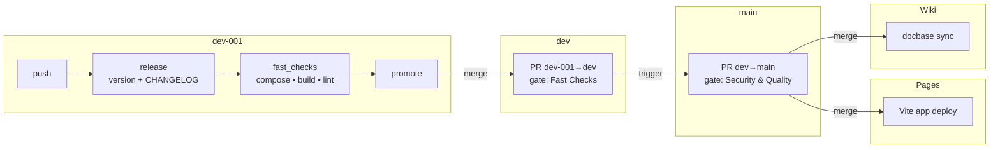
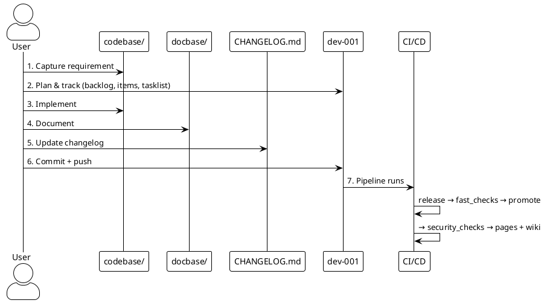

# opencode-sandbox-demo

> **Deployments:**
>
> | Target | URL |
> | --- | --- |
> | App (Vite) → GitHub Pages | <https://mcc-mak.github.io/opencode-workflow-demo/> |
> | Docs (markdown) → GitHub Wiki | <https://github.com/Mcc-Mak/opencode-workflow-demo/wiki> |
>
> **Full documentation index:** [`docbase/TOCTREE.md`](docbase/TOCTREE.md)

A Docker project that builds an **OpenCode sandbox** connecting to the HKO AI model — `zai-org/GLM-5.2-FP8` served by the HKO LiteLLM gateway. The sandbox is configured by `opencode.json` (repo root) and runs as a Docker Compose service alongside a sample React + Vite app. The repo also retains reusable infrastructure: a seven-step coding workflow, a progressive GitHub Actions CI/CD pipeline, and strict semantic versioning.

## CI/CD pipeline (Mermaid)



## Structure

```
.
├── AGENTS.md              # OpenCode session guidance (read before editing)
├── CHANGELOG.md           # versioned changelog, managed by the pipeline
├── opencode.json          # sandbox config: hko provider, GLM-5.2-FP8, API key from env
├── codebase/              # project implementation
│   ├── .env.example       # source of truth for configurable knobs
│   ├── docker-compose.yml # app + opencode services
│   ├── Dockerfile         # multi-stage: node builds Vite app → nginx serves dist/
│   ├── Dockerfile.opencode# node:24-alpine + opencode-ai + git
│   └── site/              # React + Vite application deployed to GitHub Pages
├── docbase/               # all documentation (markdown → GitHub Wiki)
│   ├── TOCTREE.md         # index of every doc (also drives wiki Home/_Sidebar)
│   └── docs/*.md          # SRS, Architecture, QuickStart, Configurations, CICD-Pipeline, RTM, CRM
└── .github/workflows/     # CI/CD pipeline
```

## Workflow

Every change follows seven steps (see `AGENTS.md`): capture the requirement → plan & track (manage issues, labels, milestones as project manager) → implement in `codebase/` → document in `docbase/` → update `CHANGELOG.md` → commit to `dev-001` → CI/CD runs.

### Workflow steps (PlantUML)



## Branch model

```
dev-001 → dev → main → GitHub Pages (app) + GitHub Wiki (docs)
```

- Work only on `dev-001`.
- `dev-001 → dev`: fast checks (compose validation, image build, lint).
- `dev → main`: quality gates — CodeQL (SAST) + SonarQube Cloud (quality gate), fail closed.
- `main → GitHub Pages`: build and deploy the React + Vite application (`codebase/site/`).
- `main → GitHub Wiki`: sync `docbase/` markdown to the repository's wiki (runs in parallel with `pages`).

Promotion is automated; never push directly to `dev` or `main`.

## Versioning

Strict `major.minor.patch`. The `release` job derives the bump from conventional commit subjects:

- `feat!:` or `BREAKING CHANGE:` → major
- `feat:` → minor
- everything else → patch

## Prerequisites

Configure secrets, notification settings, and Pages from a local `.env` (auto-config):

```bash
cp .env.example .env          # fill in tokens + notification values
./scripts/configure-secrets.sh
```

What you need before filling in `.env`:

- **`GIT_PUSH_TOKEN`** — GitHub PAT with `repo` + `workflow` scopes (pushes release commits).
- **`PROMOTE_TOKEN`** — GitHub PAT with `repo` + `workflow` scopes (PRs created by `GITHUB_TOKEN` don't trigger checks, so promotion needs a PAT; also reused to push `docbase/` to the GitHub Wiki).
- **`SONAR_TOKEN`** — SonarQube Cloud token (SonarCloud → My Account → Security). Optional.
- **`NOTIFICATION_ADDRESS`** — Email recipient for deployment notifications.
- **`NOTIFICATION_HEADER`** — Email subject header (e.g. `GitHub - [HKO] opencode-workflow-demo`).
- **`NOTIFICATION_ACTIVE`** — `true` to enable, `false` to disable.
- GitHub Pages source set to **GitHub Actions** (the script does this; or set it manually under Settings → Pages).
- `dev-001` registered as a deployment branch in **Settings → Environments → github-pages** (the script does this too).
- GitHub Wiki initialized once: open **{repo}/wiki** in the browser and create the first page. Until then the `wiki` job warns and skips (non-blocking); pages deployment is unaffected.

Real `.env` is gitignored — never commit it.

## Quick start

```bash
cp codebase/.env.example codebase/.env
docker compose --env-file codebase/.env --project-directory codebase up --build
```

Open <http://127.0.0.1:8080>.

### OpenCode sandbox

```bash
# set HKOAI_API_KEY in codebase/.env first
docker compose --env-file codebase/.env --project-directory codebase up -d
```

Open <http://127.0.0.1:61211>.
