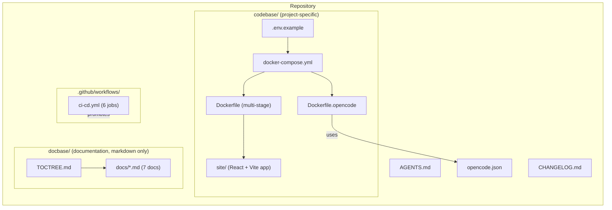
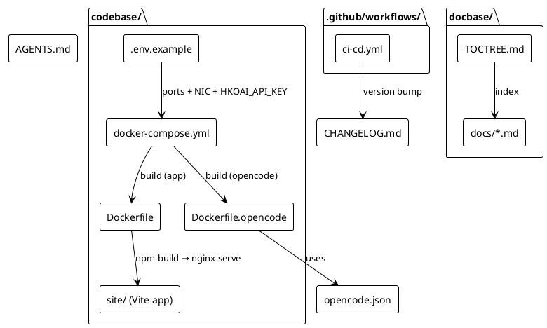
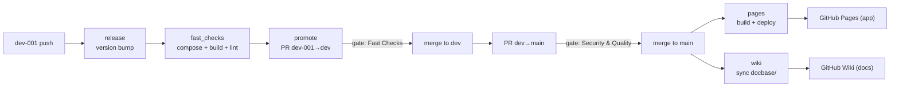
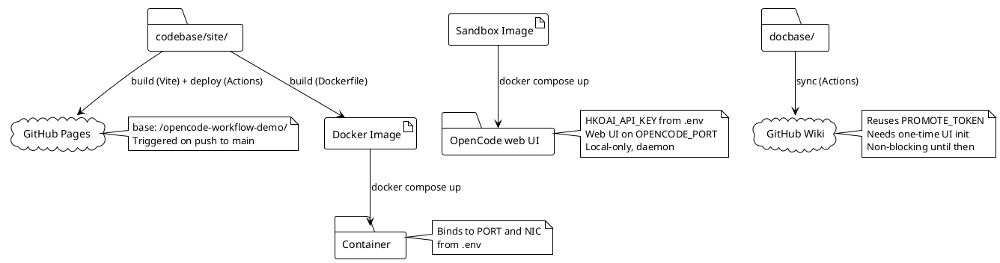

# Architecture

## Overview

This repository builds an **OpenCode sandbox** that connects to the HKO AI model (`zai-org/GLM-5.2-FP8` via LiteLLM), packaged as a Docker image. It also retains reusable infrastructure: a sample React + Vite app deployed to GitHub Pages, documentation published to the GitHub Wiki, and a progressive CI/CD pipeline. It separates **implementation** (`codebase/`) from **documentation** (`docbase/`) and **CI/CD infrastructure** (`.github/`). The pipeline progressively promotes code through three branch gates before deploying the Vite application to GitHub Pages and documentation to the GitHub Wiki.

## System structure (Mermaid)

## Components (PlantUML)

- **App service** — containerised application defined by the multi-stage `Dockerfile` (a `node` stage builds the Vite app, an `nginx` stage serves `dist/` as the non-root `nginx` user via a custom `nginx.conf` on port 8080) + `docker-compose.yml`; ports and NIC come from `.env`.
- **OpenCode sandbox** — web UI daemon defined by `Dockerfile.opencode` (`node:24-alpine` + `opencode-ai@1.18.34` + `git`), running `opencode web --hostname 0.0.0.0` (opencode's default internal port) in `docker-compose.yml`. `HKOAI_API_KEY` is passed from `.env` (local-only). Publishes the web interface on host port `OPENCODE_PORT` (default `61211`). Starts alongside the app service with `docker compose up`.
- **App site** — React + Vite SPA in `codebase/site/`, deployed to GitHub Pages. The container and Pages ship an identical `dist/` artifact.
- **Documentation** — markdown-only `docbase/`, published to the GitHub Wiki by the `wiki` job.
- **Pipeline** — six-job workflow (`release → fast_checks → promote → security_checks → pages + wiki`) that progressively promotes code from `dev-001` to GitHub Pages (app) and the GitHub Wiki (docs).

## CI/CD data flow (Mermaid)

## Deployment

The system deploys in four ways:

1. **App container** — `docker compose up --build` from `codebase/`; the multi-stage `Dockerfile` builds the Vite app and serves `dist/` from nginx, binding to the host port and NIC defined in `.env`.
2. **OpenCode sandbox** — `docker compose up` from `codebase/`; builds `Dockerfile.opencode` and starts the OpenCode web UI (`opencode web --hostname 0.0.0.0`) connected to the HKO AI model. Published on host port `OPENCODE_PORT` (default `61211`). Local-only (`HKOAI_API_KEY` in `.env`).
3. **Application** — GitHub Actions builds the Vite app in `codebase/site/` and deploys the static artifact to GitHub Pages on every push to `main`. Identical `dist/` to the container.
4. **Documentation** — GitHub Actions syncs `docbase/` markdown to the GitHub Wiki on every push to `main` (parallel with Pages).

### Deployment flow (PlantUML)

