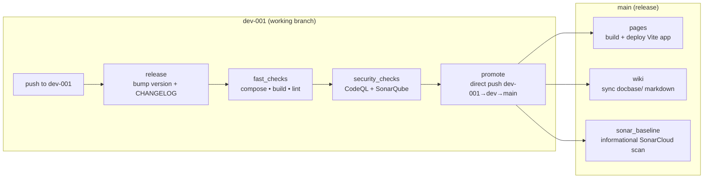
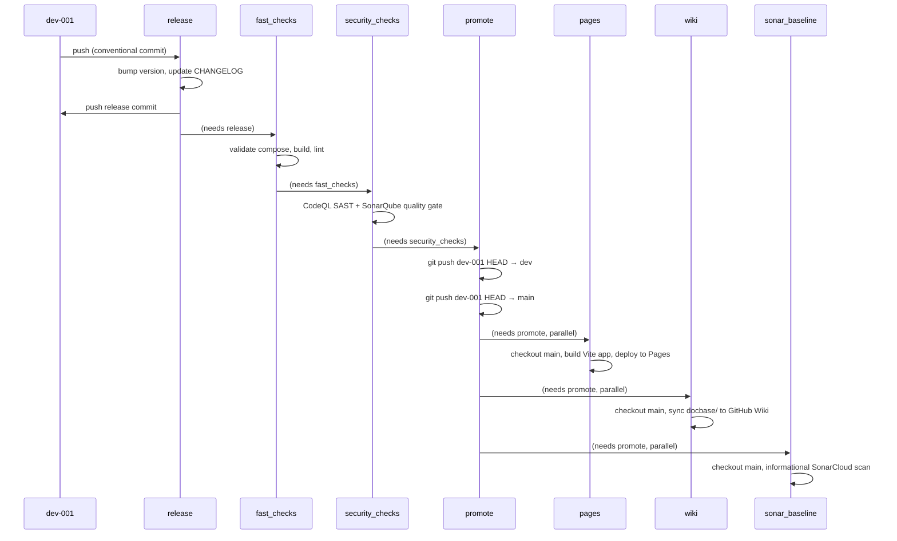
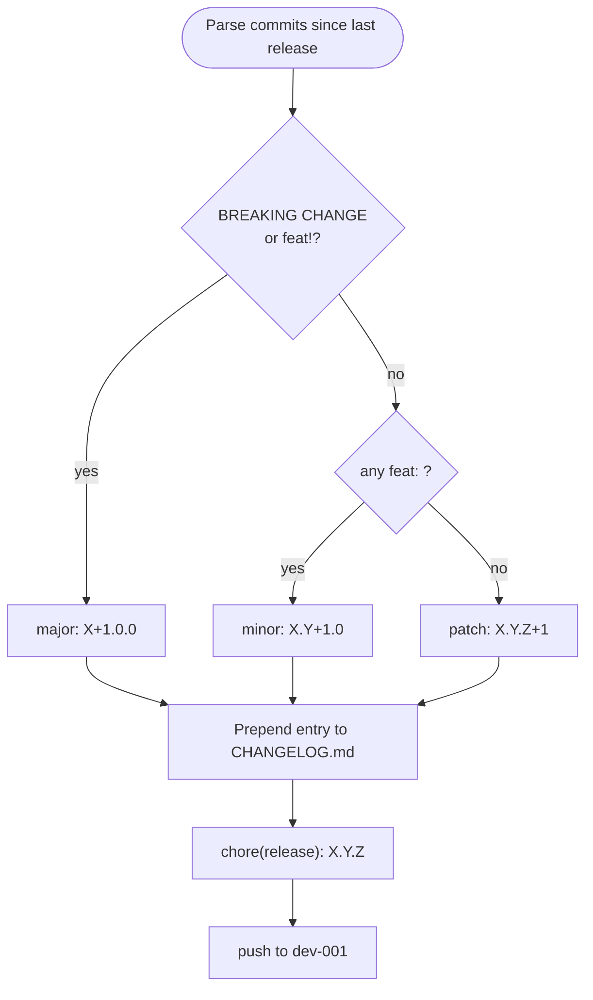
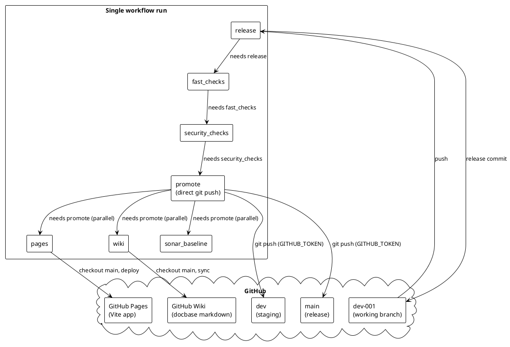

# CI/CD Pipeline

## Branch model

```
dev-001 → dev → main → GitHub Pages (app) + GitHub Wiki (docs)
```

Working branch is always `dev-001`. Promotion is automated by GitHub Actions; never push directly to `dev` or `main`.

### Pipeline overview (Mermaid)



### Job sequence (Mermaid)



## Stages

A single workflow run chains all jobs — no PR-triggered gate runs, no separate main-branch runs:

| Job | Needs | Purpose |
| --- | --- | --- |
| `release` | — | Bump version (`major.minor.patch`) from conventional commits and update `CHANGELOG.md`. |
| `fast_checks` | `release` | Validate compose, build the image, lint. Gate. |
| `security_checks` | `fast_checks` | CodeQL (SAST, mandatory hard gate) + SonarQube Cloud (quality gate, fail-closed when `SONAR_TOKEN` is configured; skipped with a notice when absent). Always fails closed on ERROR/NONE — this is a pre-promotion gate. |
| `promote` | `security_checks` | Direct `git push` of the dev-001 HEAD to `dev` and `main` using `GITHUB_TOKEN`. No PRs; gate checks already ran. `--force-with-lease` handles stale merge commits from the previous PR-based flow. |
| `pages` | `promote` | Checkout `main` (promoted commit), build the React + Vite application (`codebase/site/`) and deploy to GitHub Pages. |
| `wiki` | `promote` | Checkout `main`, sync `docbase/` markdown to the GitHub Wiki. Uses `PROMOTE_TOKEN` for the wiki repo push. Non-blocking: warns and skips if the wiki is not yet initialized (needs one-time UI page creation). |
| `sonar_baseline` | `promote` | Checkout `main`, run an informational SonarCloud scan with `GITHUB_REF` overridden to `refs/heads/main` to establish the main-branch baseline. No quality-gate check, no fail-closed. |

`GITHUB_TOKEN` pushes do not trigger new workflow runs (GitHub security feature), which is exactly what we want — the entire pipeline is one run. Previously the PR-based promotion flow triggered 4 separate workflow runs per dev-001 push; the consolidated pipeline runs once.

## Versioning

Versions are strict `major.minor.patch`. The `release` job parses commit subjects since the last `chore(release):` commit:

- `feat:` / `feat!:` → minor (or major if breaking)
- `fix:` → patch
- `BREAKING CHANGE:` in a body → major
- anything else → patch

### Version bump decision (Mermaid)



## Required secrets

| Secret | Used by | Description |
| --- | --- | --- |
| `GITHUB_TOKEN` | release, promote | Built-in token. Release pushes the version commit to dev-001; promote pushes the dev-001 HEAD to dev and main. GITHUB_TOKEN pushes do not trigger new workflow runs (by design). |
| `PROMOTE_TOKEN` | wiki | PAT for pushing docbase/ to the GitHub Wiki (separate `.wiki.git` repo). Scopes: `repo`, `workflow`. |
| `SONAR_TOKEN` | security_checks, sonar_baseline | SonarQube Cloud analysis token. Optional — when absent, security_checks runs CodeQL-only SAST and sonar_baseline is skipped. |

## Repository settings

- Enable GitHub Pages: **Settings → Pages → Source: GitHub Actions**.
- Add `dev-001` and `main` as deployment branches in **Settings → Environments → github-pages**.
- Enable the GitHub Wiki feature: **Settings → General → Features → Wikis** (the `configure-secrets.sh` script does this).
- Initialize the GitHub Wiki (one-time): open **{repo}/wiki** in the browser and create the first page. GitHub does not create the `.wiki.git` repo until this is done. The `wiki` job warns and skips (non-blocking) until then.

### Deployment topology (PlantUML)


