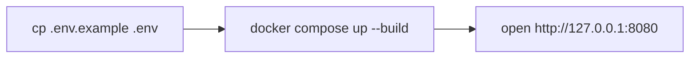
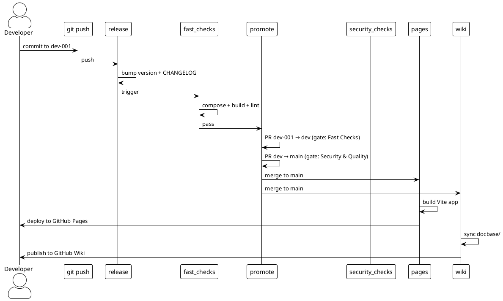

# Quick Start

## Prerequisites

- Docker
- (Optional) `jq` for pretty JSON output

## Run locally



1. Copy the environment file and adjust values:

   ```bash
   cp codebase/.env.example codebase/.env
   ```

2. Build and start the service:

   ```bash
   docker compose --env-file codebase/.env --project-directory codebase up --build
   ```

3. Open <http://127.0.0.1:8080> in a browser.

## Stop

```bash
docker compose --env-file codebase/.env --project-directory codebase down
```

## Run the OpenCode sandbox

The sandbox is an OpenCode **web UI** connected to the HKO AI model (`zai-org/GLM-5.2-FP8`). It runs as a daemon alongside the app service and publishes its web interface on host port `OPENCODE_PORT` (default `61211`; the container uses opencode's default internal port).

1. Ensure `HKOAI_API_KEY` is set in `codebase/.env` (local-only — see `codebase/.env.example`).

2. Start the sandbox (and app) with Docker Compose:

   ```bash
   docker compose --env-file codebase/.env --project-directory codebase up -d
   ```

3. Open <http://127.0.0.1:61211> in a browser.

   The service passes `HKOAI_API_KEY` from `.env`.

To run only the sandbox:

```bash
docker compose --env-file codebase/.env --project-directory codebase up -d opencode
```

## CI/CD setup (PlantUML)


